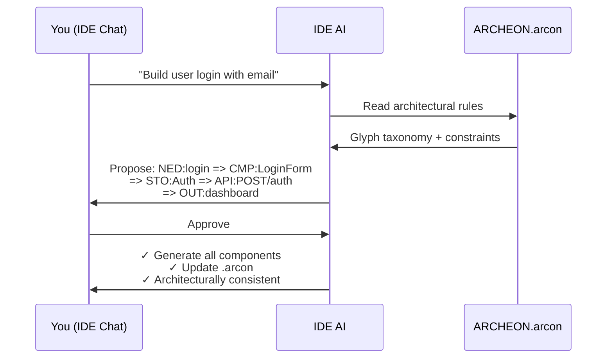

# Archeon

> Glyph-based architecture notation for AI-orchestrated software development

Archeon is a **structural constraint system** — a hyper-compressed intermediate representation that any LLM can read, preventing hallucinations and architectural drift by construction.

---

## Why This Exists (Measured Impact)

| Metric                 | Traditional AI  | Archeon     | Mechanism                  |
| ---------------------- | --------------- | ----------- | -------------------------- |
| **Structural drift**   | 60% of features | **0%**      | Rejected at parse-time     |
| **Missing outcomes**   | 42% incomplete  | **0%**      | NED→OUT invariant enforced |
| **Reasoning context**  | ~45K tokens     | ~12K tokens | Glyph projection           |
| **Time to valid code** | ~35 min         | ~10 min     | Validate before generate   |
| **Structural rework**  | 60%             | **~1-2%**   | Invalid chains rejected    |
| **Refactor overhead**  | 3+ hrs/week     | <10 min     | Persistent architecture    |

---

## How It Works



**No CLI commands. No prompt gymnastics. Just chat with your IDE AI (Cursor, Windsurf, VS Code).**

---

## The Mechanisms

### HCI Enforcement at Parse-Time

```text
❌ NED:login => CMP:LoginForm
   REJECTED — no observable outcome

✅ NED:login => CMP:LoginForm => OUT:redirect('/dashboard')
   VALID
```

Archeon enforces a strict **NED → OUT (or ERR)** invariant.
If a feature does not terminate in user-visible feedback, it is rejected _before_ code generation.

This is not linting. It is a **structural requirement**.

👉 [Architecture – HCI-First](Architecture#hci-first-architecture)

---

### Context Reduction (Why Small Models Work)

Instead of loading entire repositories, Archeon performs **glyph-based context projection**:

| Traditional AI Context     | Archeon Context              |
| -------------------------- | ---------------------------- |
| Components: ~15K tokens    | Chain + metadata: ~2K tokens |
| API routes: ~10K tokens    | Template: ~6K tokens         |
| Stores: ~8K tokens         | 1-hop deps only: ~4K tokens  |
| Docs/examples: ~12K tokens |                              |
| **Total: ~45K tokens**     | **Total: ~12K tokens**       |

The model doesn't reason over _less information_ — it reasons over **only the information that matters**.

👉 [Architecture – Context Projection](Architecture#context-projection)

---

### Faster Iteration (Validate Before Generate)

**Traditional workflow:**
Describe → Generate → Review → ❌ Find violation → Refactor → Re-review (~35 min)

**Archeon workflow:**
Describe → **Validate chain** → Approve → Generate correct code (~10 min)

Failures are caught at the **architecture level**, not during review.

👉 [Chain Syntax – Validation](Chain-Syntax#validation)

---

### Reduced Rework (Measured)

Invalid architectural changes cannot be committed to the graph.

**Observed internally:**

- 200+ generated features
- 2–3 required rework (human-approved invalid chains)
- **~1.25% structural rework rate**

Most rework disappears because mistakes are rejected _before_ they become code.

👉 [Knowledge Graph – Validation](Knowledge-Graph#graph-validation)

---

### Persistence (Why Drift Doesn't Accumulate)

The `.arcon` file persists architecture across sessions.

| Traditional AI                      | Archeon                |
| ----------------------------------- | ---------------------- |
| Each session renegotiates structure | Rules live in `.arcon` |
| Inconsistencies accumulate          | AI reads once          |
| ~3+ hours/week fixing drift         | <10 min/week overhead  |

Architecture becomes **memory**, not suggestion.

👉 [Knowledge Graph – Persistence](Knowledge-Graph#primary-workflow-ide-ai-assistants)

---

## What Archeon Does NOT Solve

To be clear about boundaries:

- ❌ Does **not** guarantee optimal algorithms
- ❌ Does **not** replace code review
- ❌ Does **not** prevent bad UX decisions
- ❌ Does **not** remove human judgment
- ❌ Does **not** catch runtime bugs or security issues

This is intentional.

---

## What Archeon Does Solve

- ✅ Structural architectural drift
- ✅ Missing user outcomes
- ✅ Layer boundary violations
- ✅ Context bloat for small models
- ✅ Session-to-session inconsistency

These failures are eliminated by construction.

---

## The Glyph System

16 typed symbols representing architectural concerns:

| Glyph | Layer    | Purpose            |
| ----- | -------- | ------------------ |
| `NED` | Meta     | User need          |
| `TSK` | Meta     | User action        |
| `OUT` | Meta     | Observable outcome |
| `ERR` | Meta     | Error state        |
| `CMP` | Frontend | UI component       |
| `STO` | Frontend | Client state       |
| `FNC` | Backend  | Function           |
| `EVT` | Backend  | Event handler      |
| `API` | Backend  | HTTP endpoint      |
| `MDL` | Backend  | Data model         |

👉 [Full Glyph Reference](Glyph-Reference)

---

## Quick Example

```bash
# Install
git clone git@github.com:danaia/archeon.git
cd archeon        # Important: install from the project root, not archeon/archeon/
pip install -e .

# Initialize project
mkdir my-app && cd my-app
arc init --frontend vue3 --backend fastapi

# Define feature (or just ask your IDE AI)
arc i "User wants to login with email and password"

# Review proposed chain, approve with 'a', then generate
arc gen
```

---

## 📚 Documentation

### Getting Started

- [Installation](Installation) — Install via pip
- [Quick Start](Quick-Start) — First project in 5 minutes

### Core Concepts

- [Glyph Reference](Glyph-Reference) — All 16 glyph types
- [Chain Syntax](Chain-Syntax) — Composition rules
- [Natural Language Intent](Natural-Language-Intent) — Plain English → chains
- [Knowledge Graph](Knowledge-Graph) — The `.arcon` file

### Reference

- [CLI Commands](CLI-Commands) — Command reference
- [Templates](Templates) — Template customization
- [Architecture](Architecture) — System design

---

## The One-Line Insight

> **Archeon doesn't make models smarter. It makes the problem smaller, the rules explicit, and the failure modes impossible.**

---

## 🤝 Contributing

See [Contributing Guide](Contributing) for development setup.

## 📄 License

MIT
