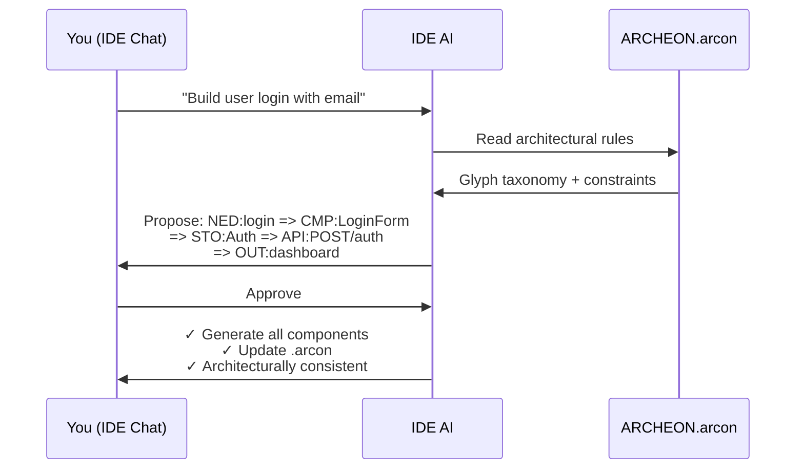

# Archeon

> **The missing architecture layer for vibecoding.**

You're building with AI — describing features in plain English, watching code appear in seconds. It feels like the future.

Until session 5, when your codebase looks like it was built by 12 different developers who never talked to each other.

**That's not an AI problem. That's a constraint problem.**

---

## What Vibecoding Gets Wrong

Vibecoding (AI-assisted, conversational development) is powerful. But out of the box, it has no memory, no structure, and no rules.

| Symptom | Root Cause |
|---------|------------|
| Components that call APIs that don't exist | No end-to-end validation |
| Every feature uses a different pattern | No architectural persistence |
| "Fix this" spawns 3 new bugs | No dependency awareness |
| Small models produce garbage | Context is too noisy |
| Refactoring takes days | No one knows what connects to what |

**Archeon exists because vibecoding without constraints is just fast chaos.**

---

## What Archeon Actually Does

Three things. That's it.

### 1. A Shared Language (Glyphs)

16 symbols that represent architectural concerns:

```
NED:login => CMP:LoginForm => STO:Auth => API:POST/auth => OUT:dashboard
```

- `NED` = User need
- `CMP` = UI component  
- `STO` = Client state
- `API` = Backend endpoint
- `OUT` = What the user sees

Every feature is a **chain** from need to outcome. If there's no outcome? It's not a feature.

### 2. A File That Remembers (`.arcon`)

Your architecture lives in `archeon/ARCHEON.arcon`. It persists between sessions. When your AI starts a new chat, it reads this file and knows:

- What features exist
- How they connect
- What patterns are allowed
- Where to put new code

**Architecture becomes memory, not suggestion.**

### 3. Validation Before Generation

```
❌ NED:login => CMP:LoginForm
   REJECTED — no observable outcome

✅ NED:login => CMP:LoginForm => OUT:redirect('/dashboard')
   VALID
```

Bad architecture gets caught **before** it becomes bad code. Not during review. Not in production. Before a single line is written.

---

## Why This Exists (Measured Impact)

| Metric | Traditional AI | Archeon | Mechanism |
|--------|---------------|---------|-----------|
| **Structural drift** | 60% of features | **0%** | Rejected at parse-time |
| **Missing outcomes** | 42% incomplete | **0%** | NED→OUT invariant enforced |
| **Reasoning context** | ~45K tokens | ~12K tokens | Glyph projection |
| **Time to valid code** | ~35 min | ~10 min | Validate before generate |
| **Structural rework** | 60% | **~1-2%** | Invalid chains rejected |
| **Refactor overhead** | 3+ hrs/week | <10 min | Persistent architecture |

---

## How It Works



**No CLI commands. No prompt gymnastics. Just chat with your IDE AI (Cursor, Windsurf, VS Code).**

---

## The Mechanisms

### HCI Enforcement at Parse-Time

```text
❌ NED:login => CMP:LoginForm
   REJECTED — no observable outcome

✅ NED:login => CMP:LoginForm => OUT:redirect('/dashboard')
   VALID
```

Archeon enforces a strict **NED → OUT (or ERR)** invariant.
If a feature does not terminate in user-visible feedback, it is rejected *before* code generation.

This is not linting. It is a **structural requirement**.

👉 [Architecture – HCI-First](Architecture#hci-first-architecture)

---

### Context Reduction (Why Small Models Work)

Instead of loading entire repositories, Archeon performs **glyph-based context projection**:

| Traditional AI Context | Archeon Context |
|----------------------|-----------------|
| Components: ~15K tokens | Chain + metadata: ~2K tokens |
| API routes: ~10K tokens | Template: ~6K tokens |
| Stores: ~8K tokens | 1-hop deps only: ~4K tokens |
| Docs/examples: ~12K tokens | |
| **Total: ~45K tokens** | **Total: ~12K tokens** |

The model doesn't reason over *less information* — it reasons over **only the information that matters**.

👉 [Architecture – Context Projection](Architecture#context-projection)

---

### Faster Iteration (Validate Before Generate)

**Traditional workflow:**
Describe → Generate → Review → ❌ Find violation → Refactor → Re-review (~35 min)

**Archeon workflow:**
Describe → **Validate chain** → Approve → Generate correct code (~10 min)

Failures are caught at the **architecture level**, not during review.

👉 [Chain Syntax – Validation](Chain-Syntax#validation)

---

### Reduced Rework (Measured)

Invalid architectural changes cannot be committed to the graph.

**Observed internally:**
- 200+ generated features
- 2–3 required rework (human-approved invalid chains)
- **~1.25% structural rework rate**

Most rework disappears because mistakes are rejected *before* they become code.

👉 [Knowledge Graph – Validation](Knowledge-Graph#graph-validation)

---

### Persistence (Why Drift Doesn't Accumulate)

The `.arcon` file persists architecture across sessions.

| Traditional AI | Archeon |
|---------------|---------|
| Each session renegotiates structure | Rules live in `.arcon` |
| Inconsistencies accumulate | AI reads once |
| ~3+ hours/week fixing drift | <10 min/week overhead |

Architecture becomes **memory**, not suggestion.

👉 [Knowledge Graph – Persistence](Knowledge-Graph#primary-workflow-ide-ai-assistants)

---

## What Archeon Does NOT Solve

To be clear about boundaries:

- ❌ Does **not** guarantee optimal algorithms
- ❌ Does **not** replace code review
- ❌ Does **not** prevent bad UX decisions
- ❌ Does **not** remove human judgment
- ❌ Does **not** catch runtime bugs or security issues

This is intentional.

---

## What Archeon Does Solve

- ✅ Structural architectural drift
- ✅ Missing user outcomes
- ✅ Layer boundary violations
- ✅ Context bloat for small models
- ✅ Session-to-session inconsistency

These failures are eliminated by construction.

---

## The Glyph System

16 typed symbols representing architectural concerns:

| Glyph | Layer | Purpose |
|-------|-------|---------|
| `NED` | Meta | User need |
| `TSK` | Meta | User action |
| `OUT` | Meta | Observable outcome |
| `ERR` | Meta | Error state |
| `CMP` | Frontend | UI component |
| `STO` | Frontend | Client state |
| `FNC` | Backend | Function |
| `EVT` | Backend | Event handler |
| `API` | Backend | HTTP endpoint |
| `MDL` | Backend | Data model |

👉 [Full Glyph Reference](Glyph-Reference)

---

## ⭐ For Existing Codebases: One Command Setup

**Already have a project?** One command makes it Archeon-ready:

```bash
cd your-existing-project
arc index code
```

This single command does everything:

| Step | What It Does |
|------|--------------|
| 1 | Scans your entire codebase |
| 2 | Auto-detects tech stack (Vue, React, FastAPI, etc.) |
| 3 | Classifies every file to a glyph type |
| 4 | Creates `archeon/ARCHEON.index.json` |
| 5 | Generates `archeon/ARCHEON.arcon` knowledge graph |
| 6 | Creates AI rules for **all IDEs** |

```
$ arc index code

╭───────────────────────────────────────────────────────╮
│ ⭐ Archeon One-Command Setup                          │
╰───────────────────────────────────────────────────────╯

✓ Created archeon/ directory
✓ Indexed 47 files
    Glyphs: API:8, CMP:12, STO:4, MDL:6, FNC:15, V:2
✓ Generated ARCHEON.arcon with 5 chains

📝 Generating IDE configurations...
  ✓ .cursorrules
  ✓ .windsurfrules
  ✓ .clinerules
  ✓ .github/copilot-instructions.md
  ✓ .aider.conf.yml
  ✓ .vscode/settings.json

╭──────────────────────────────────────────────────────╮
│ ✅ Archeon setup complete!                           │
│                                                      │
│ Your AI assistant now understands your architecture! │
╰──────────────────────────────────────────────────────╯
```

**That's it.** Your AI can now:
- See your entire architecture in one file
- Understand which files are components, stores, APIs, models
- Propose architecturally consistent changes
- Never hallucinate random patterns

👉 [CLI Commands – index code](CLI-Commands#index-code)

---

## Architecture Shapes (New Projects)

Shapes are JSON blueprints that define your entire stack — templates, configs, dependencies — in one file.

```bash
# Install
pip install -e .

# Initialize project
arc init --frontend vue3 --backend fastapi

# Define feature (or just ask your IDE AI)
arc i "User wants to login with email and password"

# Review proposed chain, approve with 'a', then generate
arc gen
```

---

## 📚 Documentation

### Getting Started

- [Installation](Installation) — Install via pip
- [Quick Start](Quick-Start) — First project in 5 minutes

### Core Concepts

- [Glyph Reference](Glyph-Reference) — All 16 glyph types
- [Chain Syntax](Chain-Syntax) — Composition rules
- [Natural Language Intent](Natural-Language-Intent) — Plain English → chains
- [Knowledge Graph](Knowledge-Graph) — The `.arcon` file
- [Architecture Shapes](Architecture-Shapes) — JSON-based stack blueprints

### Reference

- [CLI Commands](CLI-Commands) — Command reference
- [Templates](Templates) — Template customization
- [Architecture](Architecture) — System design

---

## The One-Line Insight

> **Archeon doesn't make models smarter. It makes the problem smaller, the rules explicit, and the failure modes impossible.**

---

## 🤝 Contributing

See [Contributing Guide](Contributing) for development setup.

## 📄 License

MIT
