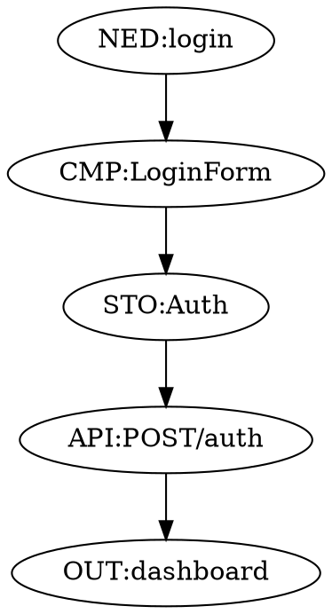

# Knowledge Graph

Understanding the `.arcon` file - Archeon's single source of truth.

## Overview

> **🎯 PRIMARY WORKFLOW: Your IDE's AI (Windsurf, Cursor, VS Code) reads this file and enforces these rules automatically. You just describe features in chat - no CLI commands needed for daily development.**

The **ARCHEON.arcon file** is the **knowledge graph** - a persistent, human-readable record of your application's architecture. It stores all glyph chains, versions, and metadata.

**How You Actually Use This:**

1. **Your IDE AI reads `ARCHEON.arcon`** when you open the project
2. **You describe features** in natural language in your IDE chat
3. **The AI proposes chains** following the rules in this file
4. **Code gets generated** with proper structure automatically

**No `arc` commands required.** The CLI exists for automation and advanced use cases, but **95% of users only work through their IDE chat**.
---

## 🚀 How This Actually Works: IDE Chat (Your Daily Workflow)

> **This is how 95% of developers use Archeon - through IDE chat, not CLI commands.**

When you use **Windsurf, VS Code Copilot, or Cursor**, the AI assistant automatically
- ✅ All chains live here
- ✅ Human-readable and git-friendly
- ✅ Versioned chains coexist
- ✅ Survives across sessions and tools
- ✅ Portable between AI models
- ✅ **Your IDE AI reads it automatically**

## Primary Workflow: IDE AI Assistants

> **The real power of Archeon is that your IDE's AI reads the `.arcon` file and enforces its rules automatically.**

When you use **Windsurf, VS Code Copilot, or Cursor**, the AI assistant reads `ARCHEON.arcon` and understands:

- The glyph taxonomy (what glyphs exist)
- The architectural rules (boundary enforcement, HCI completeness)
- The semantic section system (how to structure code)
- Existing chains (what's already built)

### How It Works

**You:** "Build a user registration flow with email validation"

**IDE AI:** 
```
I'll create this chain:

@v1 NED:register => TSK:submit => CMP:RegisterForm 
    => FNC:validateEmail => STO:Auth 
    => API:POST/register => MDL:user.create 
    => OUT:redirect('/dashboard')

Error paths:
API:POST/register -> ERR:validation.emailTaken
API:POST/register -> ERR:validation.invalidEmail

Shall I proceed?
```

**You approve, and the AI:**
1. Adds the chain to `ARCHEON.arcon`
2. Generates all components with proper semantic sections
3. Updates the semantic index
4. Creates tests for the flow

**No CLIChat vs CLI: Which Should You Use?

| Approach | Use Case | Who Uses It | Frequency |
|----------|----------|-------------|-----------|
| **💬 IDE Chat** | **PRIMARY: Daily development** | **Everyone** | **95% of the time** |
| **🔧 `arc intent`** | Automation, CI/CD, scripts | DevOps, automation engineers | 4% |
| **⚙️ `arc parse`** | Surgical control, debugging | Advanced users, troubleshooting | 1% |

**The Reality:**

```
┌─────────────────────────────────────────────────┐
│  You (in Windsurf/Cursor/VS Code):             │
│  "Build user registration with email"          │
│                                                  │
│  AI: [Reads .arcon rules]                       │
│  "I'll create this chain: NED:register => ..." │
│  "Approve?"                                      │
│                                                  │
│  You: "Yes"                                      │
│                                                  │
│  AI: ✓ Done. All files generated.              │
└─────────────────────────────────────────────────┘

NO TERMINAL. NO CLI COMMANDS. JUST CONVERSATION.
```

**The CLI exists for edge cases:**
- Running `arc validate` in CI/CD pipelines
- Batch operations from scripts
- Debugging specific parsing issues

**But you'll likely never touch it during normal development.**

Most people will **never use the CLI** - they just describe features in their IDE chat, and Archeon's rules (embedded in `.arcon`) guide the AI.

### Configuration

The `.arcon` file contains instructions for IDE AI assistants:

```
# ============================================================================
# AI INTEGRATION INSTRUCTIONS
# ============================================================================
# When the IDE AI (Copilot, Claude, etc.) generates Archeon-compatible files:
#
# 1. ALWAYS include the @archeon:file header with @glyph, @intent, @chain
# 2. ALWAYS wrap code in @archeon:section / @archeon:endsection blocks
# 3. ALWAYS update the index after creating/modifying files
# ============================================================================
```

---

When you run `arc ai-setup`, these instructions are embedded in your IDE's AI configuration. From that point on, **every conversation with your IDE AI is Archeon-aware**.

### Why This Matters

**Without Archeon:**
- You: "Build user registration"
- AI: Generates random files with inconsistent structure
- No guarantee of HCI completeness
- No architectural consistency

**With Archeon:**
- You: "Build user registration"
- AI: Reads `.arcon` rules → proposes proper chain → enforces boundaries → generates structured code
- HCI completeness guaranteed (must have NED and OUT)
- Architecture preserved across sessions

The `.arcon` file is your **persistent architectural memory** that survives across:
- Different AI models (switch from Claude to GPT)
- Different developers (everyone reads same rules)
- Different IDE sessions (rules persist in file, not chat history)

## File Location

```
my-app/
└── archeon/
    └── ARCHEON.arcon    ← Knowledge graph
```

Created automatically when you run:

```bash
arc init
```

## File Structure

### Basic Format

```
# Archeon Knowledge Graph
# Version: 3.0
# Project: my-app

# === ORCHESTRATOR LAYER (Deterministic) ===
ORC:main :: PRS:glyph :: VAL:chain :: SPW:agent

# === AGENT CHAINS (Versioned) ===

## User Authentication

@v1 NED:login => CMP:LoginForm => STO:Auth 
    => API:POST/auth/login => OUT:redirect('/dashboard')

@v2 NED:login => CMP:LoginForm => STO:Auth 
    => API:POST/auth/login => FNC:generateToken 
    => OUT:redirect('/dashboard')

## Profile Management

@v1 NED:editProfile => V:ProfilePage @ CMP:ProfileForm, CMP:AvatarUpload
    => TSK:submit => API:PUT/profile => MDL:user.update => OUT:toast('Saved')
```

### Components

#### 1. File Header

```
# Archeon Knowledge Graph
# Version: 3.0
# Project: my-app
```

- **Version** - `.arcon` format version (currently 3.0)
- **Project** - Project name

#### 2. Sections

Organize chains into logical groups using `##` headers:

```
## User Authentication
# ... auth-related chains ...

## Profile Management
# ... profile-related chains ...

## E-commerce
# ... shopping-related chains ...
```

Sections are **optional** but recommended for large projects.

#### 3. Chains

Individual glyph chains:

```
@v1 NED:login => CMP:LoginForm => API:POST/auth => OUT:dashboard
```

Each chain can have:
- **Version tag** (`@v1`, `@v2`, etc.) - optional, auto-assigned
- **Framework modifiers** (`[vue3, fastapi]`) - optional
- **Deprecation marker** (`[deprecated]`) - optional
- **Glyph sequence** - required

## Versioning System

### Why Versioning?

Versioning allows **multiple implementations** of the same feature to coexist. This is critical for:

- **A/B testing** - Test two flows side-by-side
- **Migration** - Keep old version while building new one
- **Experimentation** - Try new architectures without breaking existing code

### Version Tags

```
@v1 NED:login => CMP:LoginForm => OUT:result
@v2 NED:login => CMP:LoginForm => STO:Auth => OUT:result
@v3 NED:login => CMP:LoginForm => STO:Auth => API:POST/auth => OUT:dashboard
```

All three versions exist simultaneously in the graph.

### Auto-Versioning

If you don't specify a version, it's **auto-assigned**:

```bash
arc parse "NED:login => CMP:LoginForm => OUT:result"
# Saved as: @v1 NED:login => CMP:LoginForm => OUT:result

arc parse "NED:login => CMP:LoginForm => STO:Auth => OUT:result"
# Saved as: @v2 NED:login => CMP:LoginForm => STO:Auth => OUT:result
```

Archeon detects the root glyph (`NED:login`) and increments the version.

### Explicit Versioning

Specify a version manually:

```bash
arc parse "@v1 NED:login => CMP:LoginForm => OUT:result"
```

If `@v1` already exists, you'll get an error:

```
✗ Error: Version v1 already exists for NED:login
```

### Deprecating Versions

Mark old versions as deprecated:

```bash
arc deprecate v1 NED:login
```

Updates the graph:

```
@v1 [deprecated] NED:login => CMP:LoginForm => OUT:result
@v2 NED:login => CMP:LoginForm => STO:Auth => OUT:result  ← Active
```

Deprecated chains are **skipped** during code generation.

## Semantic Sections

The `.arcon` file also contains **instructions for AI assistants** via semantic section definitions.

### Section System

```
# ============================================================================
# SEMANTIC SECTION SYSTEM
# ============================================================================
# Archeon uses comment-based semantic bracketing for AI-native code navigation.
#
# FILE HEADER FORMAT (required at top of every generated file):
# ```
# // @archeon:file
# // @glyph CMP:LoginForm
# // @intent User login input and submission
# // @chain @v1 NED:login => CMP:LoginForm => STO:Auth => API:POST/auth
# ```
#
# SECTION FORMAT (inside files):
# ```
# // @archeon:section <snake_case_label>
# // <1-sentence intent>
# <code>
# // @archeon:endsection
# ```
```
Primary: IDE Chat (Recommended)

**Most common workflow** - just describe what you want in your IDE:

**Windsurf / VS Code / Cursor:**

```
You: "Create a login flow with email and password. Show dashboard on success."

AI: [Reads ARCHEON.arcon]
I'll build this chain:

@v1 NED:login => TSK:submit => CMP:LoginForm 
    => STO:Auth => API:POST/auth/login 
    => OUT:redirect('/dashboard')

With error paths:
API:POST/auth/login -> ERR:auth.invalidCreds
API:POST/auth/login -> ERR:auth.rateLimited

I'll create:
- CMP:LoginForm (Vue3 component)
- STO:Auth (Pinia store)
- API:POST/auth/login (FastAPI endpoint)

Approve?

You: "Yes"

AI: ✓ Added chain to archeon/ARCHEON.arcon
    ✓ Generated client/src/components/LoginForm.vue
    ✓ Generated client/src/stores/AuthStore.js
    ✓ Generated server/src/api/routes/auth_login.py
    ✓ Updated archeon/ARCHEON.index.json
```

**The AI:**
1. Reads architectural rules from `.arcon`
2. Proposes a valid chain
3. Waits for approval
4. Implements everything with proper structure

**No CLI needed.** This is how 90% of users work with Archeon.

### Alternative: CLI (Surgical Use)

For automation, scripts, or precise control:

#### Glyph Notation

```bash
arc parse "NED:login => CMP:LoginForm => OUT:result"
```

Direct chain input, no AI interpretation.

#### Natural Language

```bash
arc intent "User logs in with email and password"
# Proposal shown, [a]pprove to add
```

CLI version of what IDE AI does automatically.

#### Direct Editing

Edit the `.arcon` file manually:

```
## User Authentication

@v1 NED:login => CMP:LoginForm => STO:Auth => API:POST/auth => OUT:dashboard
```

Save and run:

```bash
arc validate  # Check for errors
arc gen       # Generate code
```

**Use cases for CLI:**
- **CI/CD pipelines** - `arc validate` in build scripts
- **Automation** - Batch chain generation from requirements docs
- **Debugging** - Precise control over chain syntax
- **Scripts** - Generate multiple chains programmatically:main :: PRS:glyph :: PRS:intent :: VAL:chain :: VAL:boundary 
    :: SPW:agent :: TST:e2e :: TST:error
GRF:domain :: ORC:main
```

This is **not application code** - it's the **meta-layer** that manages:

- **PRS:glyph** - Chain parsing
- **PRS:intent** - Natural language parsing
- **VAL:chain** - Chain validation
- **VAL:boundary** - Layer boundary enforcement
- **SPW:agent** - Agent spawning
- **GRF:domain** - Graph management
- **TST:e2e** - End-to-end testing
- **TST:error** - Error path testing

**You don't modify this layer** - it's part of Archeon's core.

## Design Token Layer

The graph documents the **design token system**:

```
# === DESIGN TOKEN LAYER ===
# TKN transforms DTCG design tokens into CSS/Tailwind/JS outputs
# Single source of truth for all design system values
TKN:transformer :: CSS:variables :: TW:config :: JS:constants
TKN:semantic :: TKN:transformer
```

This describes how design tokens flow through the system:

```
design-tokens.json → TKN:transformer → CSS variables
                                     → Tailwind config
                                     → JS constants
```

## Theme System

Theme architecture is documented in the graph:

```
# === THEME SYSTEM ===
# Two-layer theme architecture:
# 1. Mode (light/dark/system) - controls brightness/contrast (standard)
# 2. Color Theme - controls primary palette (PROJECT-SPECIFIC)
#
# IMPORTANT: Color themes (blue/purple/green in templates) are EXAMPLES.
# Each project defines its own themes based on its design system.
# The theme store constants must be customized per project.
#
# STO:Theme manages both layers and persists to localStorage
# Color themes work via CSS class swapping on document root
# Components use --color-primary-* variables which resolve to active theme
STO:Theme ~> CMP:*
TKN:transformer :: STO:Theme
```

This teaches AI assistants how themes work in your project.

## Adding Chains

### Command Line

```bash
arc parse "NED:login => CMP:LoginForm => OUT:result"
```

### Natural Language

```bash
arc intent "User logs in with email and password"
# Proposal shown, [a]pprove to add
```

### Direct Editing

You can edit the `.arcon` file directly:

```
## User Authentication

@v1 NED:login => CMP:LoginForm => STO:Auth => API:POST/auth => OUT:dashboard
```

Save and run:

```bash
arc validate  # Check for errors
arc gen       # Generate code
```

## Querying the Graph

### Find Chains by Glyph

```bash
arc status
```

Shows all glyphs and their chains:

```
Knowledge Graph Status
======================

Total chains: 5
Total glyphs: 12
Sections: User Authentication, Profile Management

Glyphs by type:
  NED: 3
  CMP: 4
  STO: 2
  API: 2
  OUT: 3
```

### Python API

```python
from archeon.orchestrator.GRF_graph import KnowledgeGraph

# Load graph
graph = KnowledgeGraph()
graph.load("archeon/ARCHEON.arcon")

# Find chains containing a glyph
chains = graph.find_chains_by_glyph("CMP:LoginForm")

for chain in chains:
    print(f"Version: {chain.ast.version}")
    print(f"Chain: {chain.ast.raw}")
    print(f"Section: {chain.section}")
    print()
```

Output:

```
Version: v1
Chain: @v1 NED:login => CMP:LoginForm => STO:Auth => API:POST/auth => OUT:dashboard
Section: User Authentication

Version: v2
Chain: @v2 NED:login => CMP:LoginForm => STO:Auth => FNC:generateToken => OUT:dashboard
Section: User Authentication
```

### Find Dependencies

```python
# Find upstream glyphs (what depends on this)
deps = graph.find_dependencies("API:POST/auth")

# Find downstream glyphs (what this depends on)
dependents = graph.find_dependents("STO:Auth")
```

### Check for Duplicates

```python
# Find all versions of a feature
versions = graph.find_chains_by_glyph("NED:login")
print(f"Found {len(versions)} versions of login")
```

## Graph Validation

### Automatic Validation

```bash
arc validate
```

Checks for:

- ✅ **Syntax errors** - Invalid glyph notation
- ✅ **HCI completeness** - Missing `NED` or `OUT`
- ✅ **Boundary violations** - Frontend calling backend directly
- ✅ **Duplicate versions** - Same version tag used twice
- ✅ **Orphaned glyphs** - Glyphs with no connections
- ✅ **Cyclical dependencies** - Cycles in `=>` edges (not allowed)

Example output:

```
Validating knowledge graph...

✓ All chains have valid syntax
✓ All chains start with NED
✓ All chains end with OUT or ERR
✓ No boundary violations detected

Warnings:
  ⚠ Chain @v1 NED:upload has no error paths
  
Summary: 5 chains, 0 errors, 1 warning
```

### Validation Rules

#### 1. HCI Completeness

Every chain must:

```
Start with NED  AND  (End with OUT OR End with ERR)
```

❌ **Invalid:**
```
NED:login => CMP:LoginForm  # No outcome
```

✅ **Valid:**
```
NED:login => CMP:LoginForm => OUT:result
```

#### 2. Boundary Enforcement

Frontend glyphs cannot call backend glyphs directly:

❌ **Invalid:**
```
CMP:LoginForm => MDL:user  # Component calling model directly
```

✅ **Valid:**
```
CMP:LoginForm => API:POST/auth => MDL:user  # Through API
```

#### 3. No Cycles in Structural Edges

`=>` edges cannot form cycles:

❌ **Invalid:**
```
CMP:A => CMP:B => CMP:A  # Cycle
```

✅ **Valid:**
```
CMP:A ~> CMP:B ~> CMP:A  # Reactive edge, cycles OK
```

## Exporting the Graph

### Visualization

```bash
arc export graph.png
```

Generates a visual diagram:

```
     NED:login
         ↓
    CMP:LoginForm
         ↓
      STO:Auth
         ↓
  API:POST/auth
         ↓
    OUT:dashboard
```

### JSON Export

```bash
arc export --format json graph.json
```

```json
{
  "chains": [
    {
      "version": "v1",
      "root": "NED:login",
      "nodes": [
        {"type": "NED", "name": "login"},
        {"type": "CMP", "name": "LoginForm"},
        {"type": "STO", "name": "Auth"},
        {"type": "API", "name": "POST/auth"},
        {"type": "OUT", "name": "dashboard"}
      ],
      "edges": [
        {"from": "NED:login", "to": "CMP:LoginForm", "type": "=>"},
        {"from": "CMP:LoginForm", "to": "STO:Auth", "type": "=>"},
        {"from": "STO:Auth", "to": "API:POST/auth", "type": "=>"},
        {"from": "API:POST/auth", "to": "OUT:dashboard", "type": "=>"}
      ]
    }
  ]
}
```

### DOT Format (Graphviz)

```bash
arc export --format dot graph.dot
```



Render with:

```bash
dot -Tpng graph.dot -o graph.png
```

## Best Practices

### Organize with Sections

✅ **Good:**

```
## User Authentication
@v1 NED:login => ...
@v1 NED:register => ...
@v1 NED:logout => ...

## Profile Management
@v1 NED:viewProfile => ...
@v1 NED:editProfile => ...
```

❌ **Bad:**

```
@v1 NED:login => ...
@v1 NED:editProfile => ...
@v1 NED:register => ...
@v1 NED:viewProfile => ...
```

### Use Semantic Versioning

```
@v1 - Initial implementation
@v2 - Added authentication
@v3 - Added token refresh
```

Not:

```
@v1 - Initial
@v17 - ???
@v42 - ???
```

### Document Intent

Add comments to clarify complex chains:

```
## User Authentication

# Basic email/password login with JWT
@v1 NED:login => CMP:LoginForm => API:POST/auth => OUT:dashboard

# OAuth2 flow with Google
@v2 NED:login => CMP:OAuthButton => API:GET/auth/google => OUT:dashboard

# Magic link (passwordless)
@v3 NED:login => CMP:EmailForm => API:POST/auth/magic => OUT:checkEmail
```

### Version Critical Paths First

Ensure core user journeys have stable versions:

```
## Critical Paths (v1 = production)

@v1 NED:login => ...
@v1 NED:checkout => ...
@v1 NED:payment => ...

## Experimental Features (higher versions)

@v2 NED:socialShare => ...
@v3 NED:aiRecommendations => ...
```

### Keep Deprecated Versions Temporarily

Don't immediately delete deprecated versions:

```
@v1 [deprecated] NED:login => CMP:OldLoginForm => OUT:result
@v2 NED:login => CMP:LoginForm => STO:Auth => OUT:dashboard
```

Helps with:
- **Rollback** - Quick revert if v2 has issues
- **Migration** - Reference old implementation
- **Debugging** - Compare v1 vs v2 behavior

Remove after confirming v2 is stable:

```bash
arc remove v1 NED:login
```

## Merge Conflicts

Since `.arcon` is a text file, it's **git-friendly**:

```bash
git merge feature-branch
```

If there's a conflict:

```
<<<<<<< HEAD
@v2 NED:login => CMP:LoginForm => STO:Auth => OUT:dashboard
=======
@v2 NED:login => CMP:LoginForm => API:POST/auth => OUT:dashboard
>>>>>>> feature-branch
```

Resolve by:

1. **Increment version** - Keep both as separate versions
2. **Choose one** - Pick the better implementation
3. **Combine** - Merge the chains manually

Example resolution (keep both):

```
@v2 NED:login => CMP:LoginForm => STO:Auth => OUT:dashboard
@v3 NED:login => CMP:LoginForm => API:POST/auth => OUT:dashboard
```

## Troubleshooting

### Graph Won't Load

**Problem:** `arc validate` fails with parse errors.

**Solution:** Check for syntax errors in `.arcon`:

```bash
arc validate --verbose
```

Look for:
- Missing `=>` operators
- Typos in glyph names
- Unclosed brackets
Real-World IDE Workflow

### Day-to-Day Development

**Morning:** You arrive at work, open Windsurf/Cursor/VS Code

**You:** "Add a feature where users can upload a profile photo. Validate file type and size. Show progress while uploading."

**AI:** [Analyzes ARCHEON.arcon]
```
Chain proposal:

@v1 NED:uploadProfilePhoto => CMP:AvatarUploader 
    => FNC:validateImage => OUT:loading 
    => API:POST/upload/avatar => MDL:user.updateAvatar 
    => STO:User => OUT:toast('Photo updated')

Error paths:
API:POST/upload/avatar -> ERR:upload.tooLarge
API:POST/upload/avatar -> ERR:upload.invalidType
FNC:validateImage -> ERR:validation.invalid

Ready to implement?
```

**You:** "Yes, but also show a preview before uploading"

**AI:** [Updates chain]
```
Updated chain:

@v1 NED:uploadProfilePhoto => CMP:AvatarUploader 
    => FNC:validateImage => OUT:display => CMP:ImagePreview
    => TSK:confirm => OUT:loading 
    => API:POST/upload/avatar => MDL:user.updateAvatar 
    => STO:User => OUT:toast('Photo updated')

Implementing...
```

**Result:** Full feature implemented with proper:
- Boundary enforcement (frontend → API → model)
- HCI completeness (need → outcome)
- Error handling (all failure paths covered)
- Semantic sections (code is self-describing)

**You never left your IDE.** You never ran `arc` commands. The `.arcon` file guided the AI the whole time.

### Team Collaboration

**Developer A** (in Windsurf):
```
"Add shopping cart feature"
```
AI reads `.arcon` → builds chain → implements

**Developer B** (in Cursor):
```
"Add checkout flow for the cart"
```
AI reads `.arcon` → sees existing cart chain → builds on it → implements

**Same architectural rules, different developers, different IDEs.** The `.arcon` file is the shared source of truth.

### Switching AI Models

**Week 1:** Using Claude 3.5 in Windsurf  
**Week 2:** Switch to GPT-4 in VS Code

**No problem.** Both models read the same `.arcon` file, enforce the same rules, generate the same structure.

### The Power of Persistence

Traditional AI chat:

```
Day 1: "Build login" → AI generates code
Day 2: "Build profile" → AI has no memory of login architecture
Result: Inconsistent structure
```

Archeon:

```
Day 1: "Build login" → AI reads .arcon → builds chain → adds to .arcon
Day 2: "Build profile" → AI reads .arcon → sees login pattern → follows same structure
Result: Architectural consistency
```

The `.arcon` file is your **persistent architectural memory**.

## Next Steps

- 📖 [Natural Language Intent](Natural-Language-Intent) - How the AI parses your requests (CLI version)
- 🔗 [Chain Syntax](Chain-Syntax) - Understanding glyph notation
- 💻 [CLI Commands](CLI-Commands) - CLI tools for automation
**Solution:** Increment version or deprecate old one:

```bash
arc deprecate v1 NED:login
arc parse "@v2 NED:login => ..."
```

### Can't Find Chain

**Problem:** `arc status` doesn't show a chain you added.

**Solution:**

1. Check if chain is in `.arcon` file
2. Ensure chain syntax is valid
3. Re-run `arc validate`

### Graph Too Large

**Problem:** `.arcon` file has 1000+ chains, hard to navigate.

**Solution:**

1. **Split by domain** - Create `auth.arcon`, `ecommerce.arcon`, etc.
2. **Archive old versions** - Move deprecated chains to `archived.arcon`
3. **Use sections** - Organize with `##` headers

## Advanced: Multiple Graphs

You can maintain multiple `.arcon` files:

```
my-app/
├── archeon/
│   ├── ARCHEON.arcon          # Main graph
│   ├── auth.arcon             # Auth subsystem
│   ├── ecommerce.arcon        # E-commerce subsystem
│   └── admin.arcon            # Admin subsystem
```

Load specific graph:

```bash
export ARCHEON_FILE=archeon/auth.arcon
arc validate
```

Or:

```bash
arc validate --graph archeon/auth.arcon
```

## Next Steps

- 📖 [Natural Language Intent](Natural-Language-Intent) - Generate chains from plain English
- 🔗 [Chain Syntax](Chain-Syntax) - Master chain composition
- 💻 [CLI Commands](CLI-Commands) - Full command reference
- 🏗️ [Architecture](Architecture) - System design and principles
